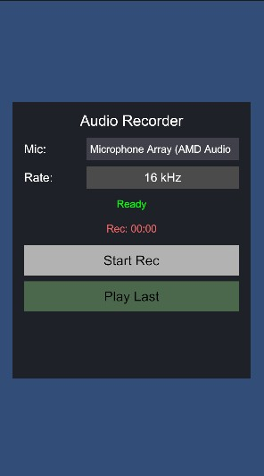

# Unity Microphone Recording Bug

We have an issue with recording data from a microphone on Android. Recordings work on every device we have tested, but 
they sound strange on a Samsung S22. Although the device seems to support sampling frequencies between 16k and 48k, 
16k and 22.05k result in awful recordings. You can find examples from the device here (16k and 22k have the issue, 
while the others are ok): [Recordings](https://drive.google.com/drive/folders/1P_-aiYirYTs5zaXHK2DAnqiV-S0oG6yF)

We have reproduced this bug on the following versions (you can test this on the `main` branch:
- 6000.0.28f1
- 6000.0.48f1

The following version does not have the problem (you can test this on the `2022_3_51f1` branch):
- 2022.3.51.f1

Another user reported a similar [issue](https://discussions.unity.com/t/bad-sound-quality-when-recording-with-16k-and-22k-sampling-frequency-on-android-device/1611412):

> I’ve same issue. only latest android device(SM-F936N, SM-F731N) model has problem.
> These devices also work well when record 44100hz sampling rate. but when I try to record 16000hz, it’s looks like 
> record 44k and play 16k wav file. I mean only 44100hz applied even use other hz when start().
> I’ve tested this in unity 6000.33 ~ 47. Actually unity 2022 is work well even in latest devices.

In this project you can find a script to reproduce this issue. Please open the `SampleScene` launch it.

